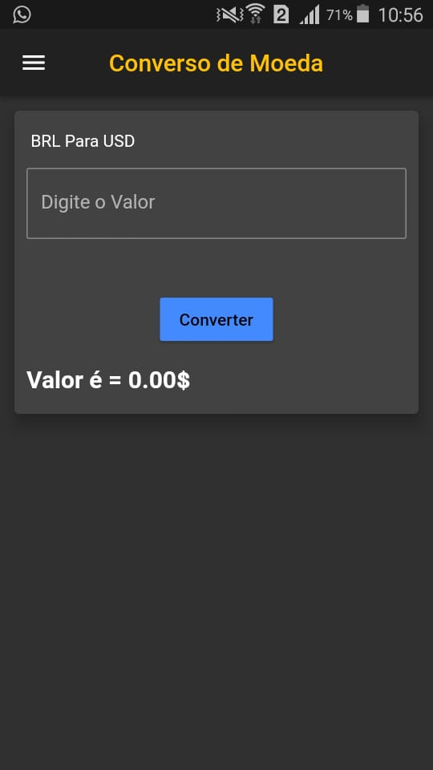
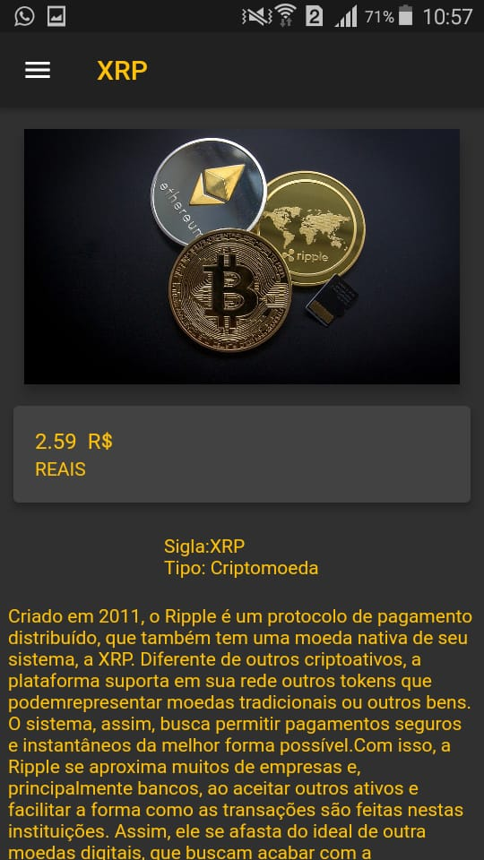

# flutter
<h1>Meus projetos em flutter tem como objetivo de aprendizagem</h1>

## Projetos que serão Desenvolvidos 

- [Converso de moedas](https://github.com/sigismundo03/Projetos-/tree/main/conversordemoedas)
<h1>
 

</h1>

- Rádio
- Loja de frutas legumes e verduras

