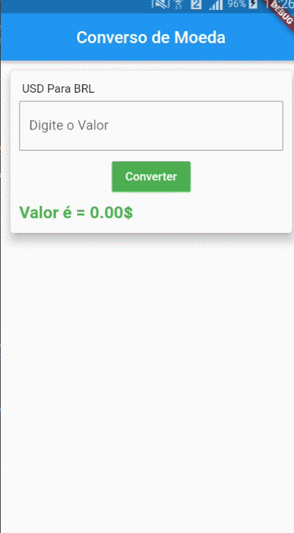

# conversordemoedas

A new Flutter project.

# Conversor de moedas

<h1 aling = "center">

</h1>

##  Sobre
**Este projeto tem como objetivo converter a moeda BRL para USD e também mostra o valor das criptomoedas, através de uma API e usar uma arquitetura MVC para ajudar nesse processo**  

## 🔨 Ferramentas

- [Visual Studio Code](https://code.visualstudio.com/)
- [Flutter](https://flutter.dev/docs) 
- [dart](https://dart.dev/guides)
- [Dio](https://pub.dev/packages/dio)
- [Get](https://pub.dev/packages/get)
- [font_awesome_flutter](https://pub.dev/packages/font_awesome_flutter)
- [URL da Api](https://free.currencyconverterapi.com/)